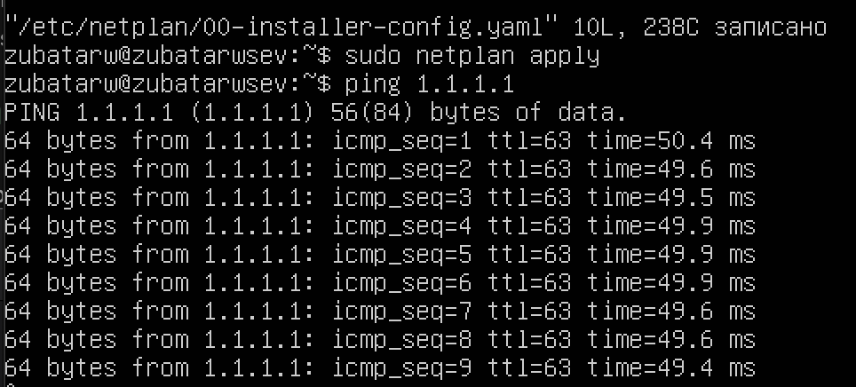
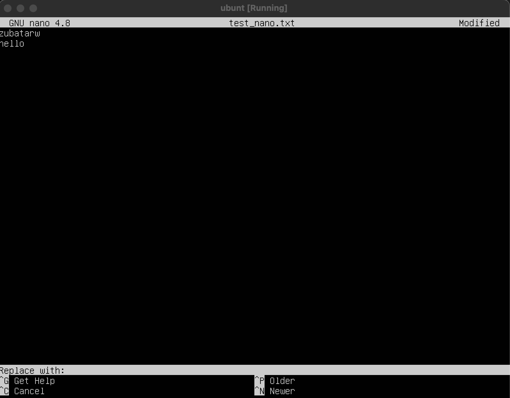
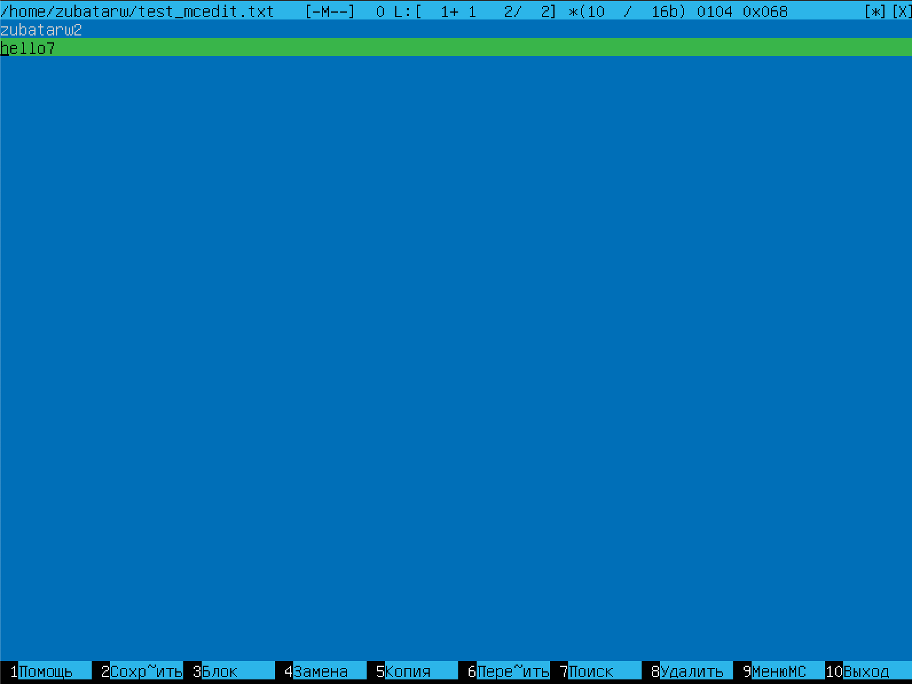
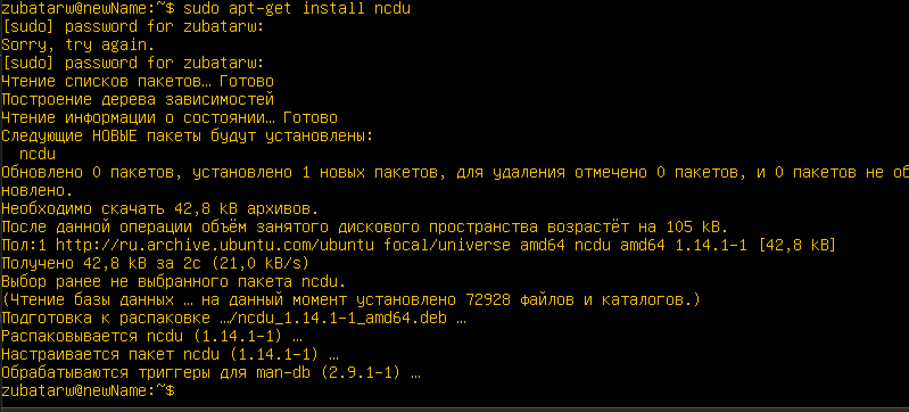

## Part 1  
- версия 20.04  
  
## Part 2  
- Скриншот команд  
 
- Скриншот cat /etc/passwd
  
## Part 3  
- заходим в hostname  
  
- задаем название машины  
  
- меняем таймзону
  
- название сетевого интерфейса  
  
- Один из самых основных виртуальных интерфейсов - lo. Это локальный интерфейс, который позволяет программам обращаться к этому компьютеру. Используя консольную команду получить ip адрес устройства, на котором вы работаете, от DHCP сервера.  
- скачивание dhcp сервера  
   
- ifconfig
  
- DHCP - это клиент-серверный протокол динамической конфигурации хоста (Dynamic Host Configuration Protocol), с помощью которого в ИТ-инфраструктуре сетевые параметры каждого нового устройства прописываются автоматически.  
- статичные настройки вручную задаются  
  
  
- после перезагрузки  
    
## Part 4  
- обновление системы пакетов  
  
## Part 5  
- поменять hostname от имени пользователя  
  
  
- измененный hostname  

- sudo -это утилита, она позволяет временно поднимать привилегии и выполнять задачи администрирования системы  
## Part 6  
- вывести время часового пояса  
  
- содержит NTPSynchronized=yes: timedatectl show
  
## Part 7  
- установление пакетов  
  
 - создание файла nano  
  
- файл с ником  
  
- vim файл  
  
- mcedit файл  
  
  
- отредактировать на 21 School 21  
  
- отредактировать на 21 School 21  
  
- отредактировать на 21 School 21  
  
- Используя каждый из трех выбранных редакторов, отредактируйте файл ещё раз (по аналогии с предыдущим пунктом), а затем освойте функции поиска по содержимому файла (слово) и замены слова на любое другое.  
- vim поиск  
  
- замена  
  
- nano поиск  
  
- замена  
  
  
- mcedit поиск  
  
  
- замена  
  
  
  
## Part 8  
- установить sshd
  
- автостарт службы при загрузке системы  
  
- статус ssh  
  
- перенастройка службы ssh на порт 2022
  
- перезапуск ssh для сохранения  
  
- наличие процесса sshd  
  
- -tan:  
- t-по протоколу TCP  
- a-Отображение всех подключений и ожидающих портов.  
- n- Отображение адресов и номеров портов в числовом формате.  
- Cтолбцы:  
- Recv-Q -количество запросов в очередях на приём на данном узле/компьютере  
- Send-Q -количество запросов в очередях на отправку на данном узле/компьютере  
- Local Address - адрес и номер локального конца сокета  
- Foreign Address - адрес и номер порта удаленного порта сокета  
- State - состояние сокета  
- Если в качестве адреса отображается 0.0.0.0 , то это означает - "любой адрес", т. е в соединении могут использоваться все IP-адреса существующие на данном компьютере.  
  
- ps -aux | grep sshd output:  
- ps-выводит список текущих процессов на вашем сервере в виде таблицы  
- a-выбрать все процессы, кроме фоновых;  
- u-выбрать процессы пользователя.  
- x-заставляет ps перечислить все процессы, принадлежащие вам  
## Part 9  
  
- uptime  
  
- количество авторизованных пользователей  
  
- общая загрузка системы  
  
- общее количество процессов
  
- загрузку cpu  
  
- загрузку памяти  
  
- pid процесса занимающего больше всего памяти  и pid процесса, занимающего больше всего процессорного времени  
  
- отсортированно по PID  
  
- PERCENT_CPU  
  
- PERCENT_MEM  
  
- TIME  
  
- отфильтрованному для процесса sshd  
  
- с процессом syslog, найденным, используя поиск  
  
- с добавленным выводом hostname, clock и uptime  
  
## Part 10  
  
- swap раздел не активирован  
## Part 11  
  
- размер раздела - 5492096  
- размер занятого пространства - 2673056  
- размер свободного пространства - 2519216  
- процент использования - 52%  
- единица измерения в выводе-килобайты  
  
- размер раздела - 5.3Gb  
- размер занятого пространства - 2.6Gb  
- размер свободного пространства - 2.5Gb  
- процент использования - 52%  
- тип файловой системы для раздела - ext4  
## Part 12  
- размер папок /home, /var, /var/log (в байтах, в человекочитаемом виде)  
  
- Выведи размер всего содержимого в /var/log (не общее, а каждого вложенного элемента, используя *)  
   
## Part 13  
- установка утилиты  
   
- размер папок /home   
  
- /var   
  
- /var/log   
  
## Part 14  
- 1. /var/log/dmesg  
  
- 2. /var/log/syslog  
  
- 3. /var/log/auth.log  
  
- перезапуск службы sshd
  
## Part 15  
- открываем cron, через crontab -e, прописываем uptime 
  
- каждые 2 минуты uptime  
  
- удаляем из cron эту задачу  
  