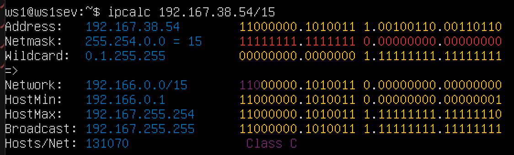
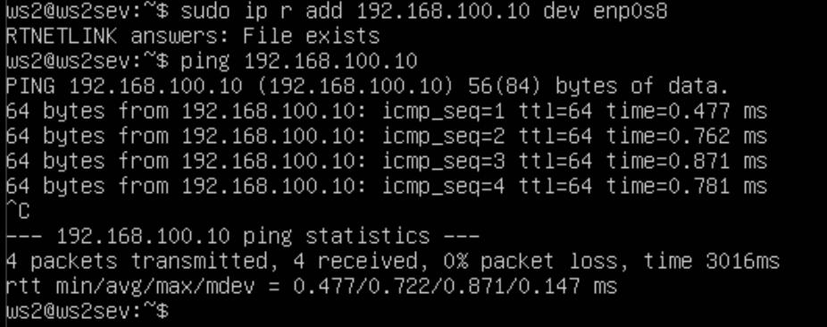
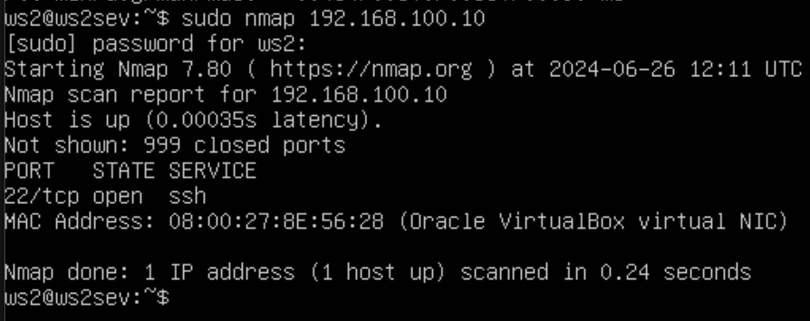
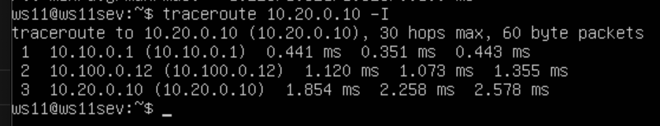
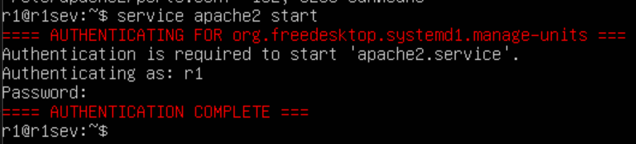
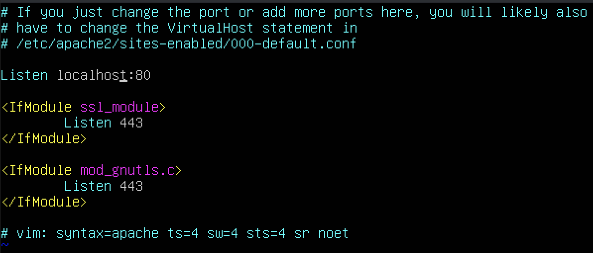

## Part 1. Инструмент ipcalc  
- пишем ipcalc, адрес сети 192.167.38.54/13  
  
- перевод маски 255.255.255.0 в префиксную и двоичную запись  
  
- /15 в обычную и двоичную  
  
- 11111111.11111111.11111111.11110000 в обычную и префиксную  
  
- минимальный и максимальный хост в сети 12.167.38.4 при масках: /8  
  
- 11111111.11111111.00000000.00000000  
  
- 255.255.254.0  
  
- /4  
  
- localhost  
- можно: 127.0.0.2, 127.1.0.1  
- нельзя: 194.34.23.100, 128.0.0.1  
- так как localhost находится в диапазоне 127.0.0.1 — 127.255.255.254  

- частные ip: 10.0.0.45, 192.168.4.2, 172.20.250.4, 172.16.255.255, 10.10.10.10  
- публичные ip: 134.43.0.2, 172.0.2.1, 192.172.0.1, 172.68.0.2, 192.169.168.1  

- ip адресов шлюза возможны у сети 10.10.0.0/18:
- должно находиться в диапазоне 10.10.0.1-10.10.63.254
- не подходит: 10.0.0.1, 10.10.100.1  
- подходит: 10.10.0.2, 10.10.10.10, 10.10.1.255  

## Part 2. Статическая маршрутизация между двумя машинами  
- подними две виртуальные машины (далее -- ws1 и ws2).  
  
- с помощью команды ip a посмотри существующие сетевые интерфейсы.  
  
  
- Опиши сетевой интерфейс, соответствующий внутренней сети, на обеих машинах и задать следующие адреса и маски: ws1 - 192.168.100.10, маска /16, ws2 - 172.24.116.8, маска /12. Выполни команду netplan apply для перезапуска сервиса сети.
  
  
- Добавление статического маршрута вручную. Добавить статический маршрут от одной машины до другой и обратно при помощи команды вида ip r add
  
  
- Добавление статического маршрута с сохранением. Добавь статический маршрут от одной машины до другой с помощью файла /etc/netplan/00-installer-config.yaml. 
  
  
- Пропингуй соединение между машинами.
  
  
## Part 3. Утилита iperf3  
- Скорость соединения. Переведи и запиши в отчёт: 8 Mbps в MB/s, 100 MB/s в Kbps, 1 Gbps в Mbps.  
- 8 Mbps = 1 MB/s(мегабит/c в мегабайт/c)  
- 100 MB/s = 800000 Kbps(мегабайт/c в килобит/c)  
- 1 Gbps = 1024 Mbps(гигабит/c в мегабит/c)  
- Утилита iperf3. Измерь скорость соединения между ws1 и ws2.  
  
  
## Part 4. Сетевой экран
- Утилита iptables. Создай файл /etc/firewall.sh, имитирующий фаерволл, на ws1 и ws2:  
- Нужно добавить в файл подряд следующие правила:  
- 1) На ws1 примени стратегию, когда в начале пишется запрещающее правило, а в конце пишется разрешающее правило (это касается пунктов 4 и 5).  
- 2) На ws2 примени стратегию, когда в начале пишется разрешающее правило, а в конце пишется запрещающее правило (это касается пунктов 4 и 5).  
- 3) Открой на машинах доступ для порта 22 (ssh) и порта 80 (http).  
- 4) Запрети echo reply (машина не должна «пинговаться», т.е. должна быть блокировка на OUTPUT).  
- 5) Разреши echo reply (машина должна «пинговаться»).  
  
  
- в первом файле первым подходящим правилом для пакета является запрет, а во втором - разрешение. применяется только первое подходящее правило, остальные игнорируются.
- Запусти файлы на обеих машинах командами chmod +x /etc/firewall.sh и /etc/firewall.sh.  
  
  
- Утилита nmap. Командой ping найди машину, которая не «пингуется», после чего утилитой nmap покажи, что хост машины запущен.  
  
  
  
  
- Сохрани дампы образов виртуальных машин  
  
## Part 5. Статическая маршрутизация сети  
- 5.1. Настройка адресов машин. Настрой конфигурации машин в etc/netplan/00-installer-config.yaml согласно сети на рисунке.  
  
  
  
  
  
- Перезапусти сервис сети. Если ошибок нет, то командой ip -4 a проверь, что адрес машины задан верно.  
  
  
  
  
  
- Также пропингуй ws22 с ws21. Аналогично пропингуй r1 с ws11.  
  
  
- 5.2. Включение переадресации IP-адресов. Для включения переадресации IP, выполни команду на роутерах: sysctl -w net.ipv4.ip_forward=1. При таком подходе переадресация не будет работать после перезагрузки системы.  
  
  
- Открой файл /etc/sysctl.conf и добавь в него следующую строку: net.ipv4.ip_forward = 1. При использовании этого подхода, IP-переадресация включена на постоянной основе.  
  
  
- Настрой маршрут по-умолчанию (шлюз) для рабочих станций. Для этого добавь default перед IP роутера в файле конфигураций. В отчёт помести скрин с содержанием файла etc/netplan/00-installer-config.yaml;  
  
  
  
  
  
- Вызови ip r и покажи, что добавился маршрут в таблицу маршрутизации.  
  
  
  
  
  
- Пропингуй с ws11 роутер r2 и покажи на r2, что пинг доходит. Для этого используй команду: tcpdump -tn -i eth0  
  
  
- 5.4. Добавление статических маршрутов. Добавь в роутеры r1 и r2 статические маршруты в файле конфигураций. Пример для r1 маршрута в сетку 10.20.0.0/26:  
  
  
- Вызови ip r и покажи таблицы с маршрутами на обоих роутерах. Пример таблицы на r1:  
  
  
- Запусти команды на ws11: ip r list 10.10.0.0/[маска сети] и ip r list 0.0.0.0/0  
  
- Маршрут по умолчанию имеет более низкий приоритет и срабатывает, когда не найден подходящий маршрут в таблице маршрутизации. 0.0.0.0/0 - это немаршрутизируемый адрес, который можно использовать в разных целях, в основном, в качестве адреса по умолчанию или адреса-заполнителя. Маршрут по умолчанию имеет более низкий приоритет и срабатывает, когда не найден подходящий маршрут в таблице маршрутизации. Для сети 10.10.0.0 мы создали правило, соответственно используется созданный маршрут. Также можно устанавливать метрику, чтобы менять приоритеты маршрутов.  
- 5.5. Построение списка маршрутизаторов. Запусти на r1 команду дампа: tcpdump -tnv -i eth0. При помощи утилиты traceroute построй список маршрутизаторов на пути от ws11 до ws21.  
  
  
- Принцип работы traceroute: Утилита отправляет целевому узлу несколько пакетов с временем жизни 1 (TTL, time to live - число переходов, которые пакет может осуществить до своего исчезновения). Следующий маршрутизатор принимает пакеты и отправляет сообщение, что время жизни пакетов истекло. traceroute фиксирует адрес этого маршрутизатора и отправляет следующие пакеты, уже с TTL 2. Так, каждый раз увеличивая TTL на 1, traceroute составляет список маршрутизаторов, через которе прошли пакеты до целевого узла. Для определения промежуточных маршрутизаторов traceroute отправляет серию пакетов данных целевому узлу, при этом каждый раз увеличивая на 1 значение поля TTL («время жизни»). Это поле обычно указывает максимальное количество маршрутизаторов, которое может быть пройдено пакетом. Первый пакет отправляется с TTL, равным 1, и поэтому первый же маршрутизатор возвращает обратно сообщение ICMP, указывающее на невозможность доставки данных. Traceroute фиксирует адрес маршрутизатора, а также время между отправкой пакета и получением ответа (эти сведения выводятся на монитор компьютера). Затем traceroute повторяет отправку пакета, но уже с TTL, равным 2, что позволяет первому маршрутизатору пропустить пакет дальше.  
- 5.6. Использование протокола ICMP при маршрутизации. Запусти на r1 перехват сетевого трафика, проходящего через eth0 с помощью команды: tcpdump -n -i eth0 icmp. Пропингуй с ws11 несуществующий IP (например, 10.30.0.111) с помощью команды: ping -c 1 10.30.0.111.  
  
Сохрани дампы образов виртуальных машин.  
  
## Part 6. Динамическая настройка IP с помощью DHCP  
- Для r2 настрой в файле /etc/dhcp/dhcpd.conf конфигурацию службы DHCP: Укажи адрес маршрутизатора по-умолчанию, DNS-сервер и адрес внутренней сети.  
  
- В файле resolv.conf пропиши nameserver 8.8.8.8.  
  
- Перезагрузи службу DHCP командой systemctl restart isc-dhcp-server. Машину ws21 перезагрузи при помощи reboot и через ip a покажи, что она получила адрес. Также пропингуй ws22 с ws21.  
  
  
  
- Укажи MAC адрес у ws11, для этого в etc/netplan/00-installer-config.yaml надо добавить строки: macaddress: 10:10:10:10:10:BA, dhcp4: true.  
  
- Для r1 настрой аналогично r2, но сделай выдачу адресов с жесткой привязкой к MAC-адресу (ws11).   
  
  
- Запроси с ws11 обновление ip адреса.  
  
- Сохрани дампы образов виртуальных машин.  
  
## Part 7. NAT
- В файле /etc/apache2/ports.conf на ws22 и r1 измени строку Listen 80 на Listen 0.0.0.0:80, то есть сделай сервер Apache2 общедоступным.  
  
  
- Запусти веб-сервер Apache командой service apache2 start на ws22 и r1.  
  
  
- Добавь в фаервол, созданный по аналогии с фаерволом из Части 4, на r2 следующие правила:  
1) Удаление правил в таблице filter - iptables -F;  
2) Удаление правил в таблице "NAT" - iptables -F -t nat;  
3) Отбрасывать все маршрутизируемые пакеты - iptables --policy FORWARD DROP.  
  
- Проверь соединение между ws22 и r1 командой ping.  
  
- Разрешить маршрутизацию всех пакетов протокола ICMP.  
  
- Проверь соединение между ws22 и r1 командой ping.  
```bash
ping 10.100.0.11
```
- Включи SNAT, а именно маскирование всех локальных ip из локальной сети, находящейся за r2 (по обозначениям из Части 5 - сеть 10.20.0.0). Включи DNAT на 8080 порт машины r2 и добавить к веб-серверу Apache, запущенному на ws22, доступ извне сети.  
  
- Проверь соединение по TCP для SNAT: для этого с ws22 подключиться к серверу Apache на r1 командой: telnet [адрес] [порт]  
  
- Проверь соединение по TCP для DNAT: для этого с r1 подключиться к серверу Apache на ws22 командой telnet (обращаться по адресу r2 и порту 8080).  
  
## Part 8. Дополнительно. Знакомство с SSH Tunnels  
- Запусти веб-сервер Apache на ws22 только на localhost (то есть в файле /etc/apache2/ports.conf измени строку Listen 80 на Listen localhost:80).  
  
- Запустить фаервол, запустить сервер apache2 на ws22  
  
- Воспользуйся Local TCP forwarding с ws21 до ws22, чтобы получить доступ к веб-серверу на ws22 с ws21.  
  
  
  
- Воспользуйся Remote TCP forwarding c ws11 до ws22, чтобы получить доступ к веб-серверу на ws22 с ws11.  
  
  
- Для проверки, сработало ли подключение в обоих предыдущих пунктах, перейди во второй терминал (например, клавишами Alt + F2) и выполни команду: telnet 127.0.0.1 [локальный порт]  
  